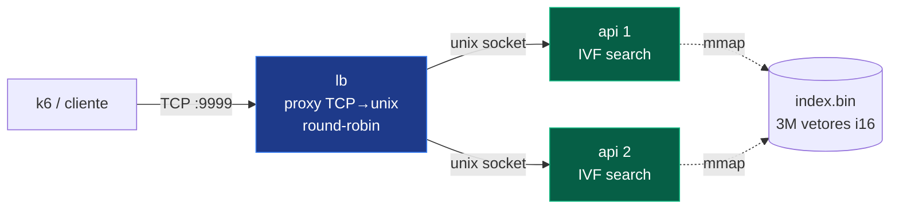

# 🦀 rinha-de-backend-2026 — karlos-rust

Detecção de fraude em transações de cartão por **busca vetorial (k-NN, k=5)** para a
[Rinha de Backend 2026](https://github.com/zanfranceschi/rinha-de-backend-2026).

Um módulo que, para cada transação, transforma o payload em um vetor de 14 dimensões,
encontra as 5 transações mais parecidas em um dataset de **3.000.000** de vetores
rotulados e decide, em **~1 ms**, se aprova ou nega — tudo dentro de **1 CPU** e
**350 MB de RAM**.

```
┌──────────────────────────────────────────────────────────────┐
│  Benchmark local (imagem publicada, limites reais 1CPU/350MB)  │
├──────────────────────────────────────────────────────────────┤
│  p99 ............... ~1,1 ms        (teto de pontuação: 1 ms)   │
│  falsos positivos .. 2 / 54.100     falsos negativos .. 0       │
│  erros HTTP ........ 0              taxa de falha ... 0,004 %    │
│  memória em carga .. lb 11 MB · api 12 MB  (de 165 MB)          │
│  score estimado .... ~5.800 / 6.000                            │
└──────────────────────────────────────────────────────────────┘
```

> A pontuação combina **latência (p99)** e **qualidade de detecção**, cada uma de
> −3000 a +3000. Detalhes em [AVALIACAO.md](https://github.com/zanfranceschi/rinha-de-backend-2026/blob/main/docs/br/AVALIACAO.md).

---

## 🏛️ Arquitetura



- **Sem GC** (Rust) → cauda de latência previsível.
- **Load balancer próprio** (binário `lb`): proxy TCP→unix round-robin, *sem nginx*
  (elimina o overhead de TCP loopback que segurava o p99 em ~27 ms).
- **APIs em unix socket** num `tmpfs` compartilhado — comunicação sem TCP entre LB e APIs.
- **`cpuset`** pina cada serviço a cores dedicados (sem contenção/jitter de scheduler).
- **Índice pré-construído** e embutido na imagem; o startup só faz `mmap` → `/ready` imediato.

---

## 🔎 Como a detecção funciona

Cada transação vira um vetor de **14 dimensões normalizadas**:

| # | Dimensão | # | Dimensão |
|---|---|---|---|
| 0 | `amount` | 7 | `km_from_home` |
| 1 | `installments` | 8 | `tx_count_24h` |
| 2 | `amount_vs_avg` | 9 | `is_online` |
| 3 | `hour_of_day` | 10 | `card_present` |
| 4 | `day_of_week` | 11 | `unknown_merchant` |
| 5 | `minutes_since_last_tx` (−1 = sem histórico) | 12 | `mcc_risk` |
| 6 | `km_from_last_tx` (−1 = sem histórico) | 13 | `merchant_avg_amount` |

A decisão: `fraud_score = nº de fraudes entre os 5 vizinhos / 5`, e
`approved = fraud_score < 0.6`.

### Busca: IVF (inverted file)

Força bruta em 3M × 14 por requisição é inviável sob 1 CPU. A solução é um índice
**IVF**: o `k-means` agrupa os 3M vetores em **2048 clusters** no build; cada consulta
calcula a distância só aos centróides, sonda os **`nprobe`** clusters mais próximos e
faz busca exata só dentro deles — tocando ~dezenas de milhares de vetores em vez de 3M.

- Com `nprobe=24`: ~35 mil vetores/consulta, 2 FP / 0 FN no gabarito de prévia.
- Com `nprobe≥96`: recall total — **0 erros** (igual ao k-NN exato de referência).

---

## ⚙️ Decisões de engenharia (e as lições no caminho)

As otimizações que importaram, da maior pra menor:

| Decisão | Impacto |
|---|---|
| **LB próprio + unix socket** no lugar do nginx | p99 27 ms → ~1 ms. O nginx+TCP loopback (Nagle/buffering) era o gargalo, não o cálculo. |
| **IVF** em vez de força bruta | sustenta 900 req/s; força bruta colapsava a fila. |
| **Quantização i16 sem perda** (escala 10000) | reduz a memória de 168 MB (f32) para 96 MB **sem** perder recall. |
| **Distância com acumulador i32** | habilita AVX2 (`vpmaddwd`); ~3× mais rápido que i64 (que matava a vetorização). |
| **`cpuset` + `mmap` + `memlock`** | menos jitter de CPU e zero page fault no hot path. |
| **Stacks de thread pequenos + `MALLOC_ARENA_MAX`** | mantém o LB e as APIs com folga de memória sob centenas de conexões. |

> 💡 A maior lição: num teste com 1 CPU e p99 medido, **a camada de transporte
> (LB/Nagle/CPU pinning) pesou mais do que o algoritmo de busca**.

---

## 🗂️ Layout do índice (`index.bin`, mmap-ável, little-endian)

```
header     : magic, num_vectors, num_clusters
centroids  : num_clusters × 14  f32        (seleção de clusters)
offsets    : (num_clusters+1)   u32        (prefix sum por cluster)
vectors    : num_vectors × 16   i16        (reordenados por cluster, pad 14→16)
labels     : bitset             (1 bit/vetor: 1 = fraude)
```

---

## 📁 Estrutura

| Arquivo | Papel |
|---|---|
| `src/lib.rs` | Vetorização (14 dims), parsing de timestamp, formato do índice e busca IVF |
| `src/main.rs` | Servidor HTTP/1.1 próprio (unix socket), `GET /ready` + `POST /fraud-score` |
| `src/bin/lb.rs` | Load balancer (proxy TCP→unix, round-robin) |
| `src/bin/build_index.rs` | Pré-processa `references.json.gz` no blob `index.bin` (k-means + quantização) |
| `src/bin/validate.rs` | Mede recall/score contra o gabarito (offline) |
| `src/bin/diag.rs` | k-NN exato (brute force) para diagnóstico de recall |
| `Dockerfile` | Imagem `linux/amd64` (alvo Haswell, `target-cpu=x86-64-v3`) com `server` + `lb` + índice |
| `docker-compose.yml` | LB + 2 APIs, unix socket em tmpfs, cpuset, limites de recursos |

---

## 🚀 Build e execução

**1. Construir o índice** (uma vez, fora do runtime):

```sh
cargo run --release --bin build_index -- references.json.gz index.bin 2048
```

**2. Rodar a stack completa** (LB + 2 APIs):

```sh
docker compose up
# expõe a porta 9999
```

**3. Rodar só uma API localmente** (TCP, para testes):

```sh
INDEX_PATH=index.bin PORT=8080 NPROBE=24 cargo run --release --bin server
```

**4. Medir recall/score offline** contra o gabarito:

```sh
cargo run --release --bin validate -- index.bin test/test-data.json 8,16,24,96
```

---

## 📦 Orçamento de recursos

| Serviço | CPU | Memória | cpuset |
|---|---|---|---|
| `lb` | 0.10 | 16 MB | 2,3 |
| `api1` | 0.45 | 165 MB | 0 |
| `api2` | 0.45 | 165 MB | 1 |
| **Total** | **1.00** | **346 MB** | — |

Dentro do teto da Rinha: **1 CPU** e **350 MB**. Rede `bridge`.

---

## 🌿 Branches

- **`main`** — código-fonte completo.
- **`submission`** — apenas o necessário para o teste (`docker-compose.yml`, `info.json`),
  conforme as regras da Rinha. A imagem é puxada de
  `ghcr.io/karlos-silva/rinha-fraud:latest`.

---

## 📜 Licença

[MIT](./LICENSE) — feito para a Rinha de Backend 2026.
